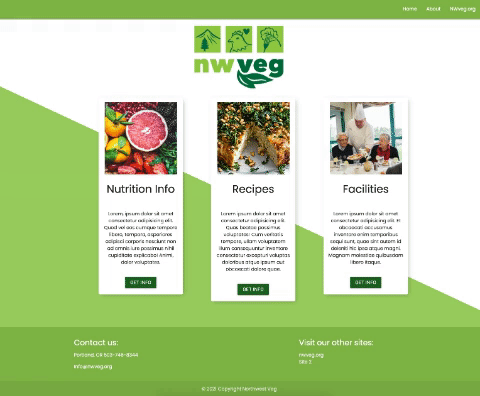

# Northwest Veg
  


<a href="https://northwest-veg.herokuapp.com/">Click here to see it in action.</a>

## Table of Contents
* [Description](#description)
* [Installation](#installation)
* [Usage](#usage)
* [License](#license)
* [Contributions](#contributions)
* [Tests](#tests)
* [Questions](#questions)

## Description 
*Overview of this project:* 
* We set out to build an application that allows user's and facilities that are interested in incorporating a plant based diet into their programs and lives! We make it simple by providing informative articles, a recipes page that allows you to filter by ingredient(s) to help you make your desired meal, and having an accessible and easy to fill out form for interested facilites.

## Installation
*Steps required to install project and get the development environment established:*
* Simply use the npm install command in your terminal to install all necessary packages to launch our plant based application!

```bash
node i dotenv
node i express
node i express-handlebars
node i handlebars
node i handlebars-form-helpers
node i hbs
node i materialize-css
node i mysql
node i mysql12
node i node-fetch
node i sequelize
```

## Usage
*Instructions and examples for use:* 
* On the home page you will find the three main categories. There is an info page that gives information about a veg diet and nutiritional information. If you click on the recipe section you will be taken to a recipe page that has popular categories of recipies and a search bar at the top where you can search for any type of veg recipies you would like to find. After you have found the recipe you are looking for you can add the ingridience to your shopping list. The third section is the facility section where facilities that provide a veg menu are featured. We created a form page where the admins can enter faciliities that will then be stored in the data base and will be displayed on the facilities page.  



## License 
* Built under the MIT licence.

## Credits
* Built & designed by Tomara Petty, Markos Escalante, Lili Cohen and Kat Nguyen.

## Test
* No tests required. 

## Questions?
<p float="left">


</p>
<br>

#### If you have any questions or want to make a contribution please reach out to us here:
<br>

**GitHub:** 
* @tomarapetty 
* @lilipcohen 
* @markos-escalante 
* @katnguyenn <br>

**Email:** 
* nguyenkat01@yahoo.com
* tomararuth@gmail.com 
* lili.cohen.tv@gmail.com 
* escalante.markos18@gmail.com <br>

**LinkedIn:** 
* Tomara: https://www.linkedin.com/in/tomara-petty/ 
* Lili: http://www.linkedin.com/in/lili-cohen-78a93a1b3 
* Kat: https://www.linkedin.com/in/katherine-nguyen-205a7b13a/ 
* Markos: https://www.linkedin.com/feed/

